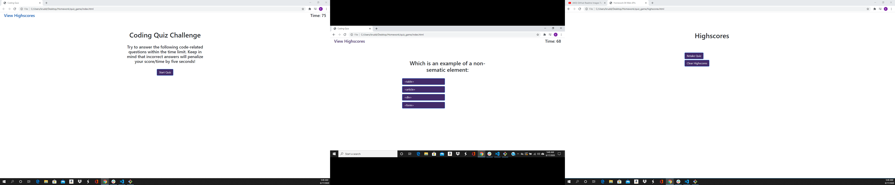

# quiz_game
Build a timed code quiz with multiple-choice questions. This app will run in the browser and feature dynamically updated HTML and CSS powered by your JavaScript code. It will also feature a clean and polished user interface and be responsive, ensuring that it adapts to multiple screen sizes.

GIVEN I am taking a code quiz
WHEN I click the start button
THEN a timer starts and I am presented with a question
WHEN I answer a question
THEN I am presented with another question
WHEN I answer a question incorrectly
THEN time is subtracted from the clock
WHEN all questions are answered or the timer reaches 0
THEN the game is over
WHEN the game is over
THEN I can save my initials and score

// Timer
// Start time is 75 seconds
// When Start button is clicked timer starts
// When wrong answer is clicked 5 secons is penalized
// When timer reaches 0 page pulls up score and input box for initials

// Start Page
// basic information about the page with start button
// linked highscore page in the top left corner
// when start button is clicked the quiz and timer starts

// Questions
// when start button is clicked first question starts
// when qeustion appears you have 4 available options
// when you choose correct option, you move onto the next question
// when you choose incorrect option you are penalized 5 seconds and move on to next question
// quiz is done when you answer 8 questions or timer runs out
// after last question you are taken to page with score and input box for initials
// should have extra questions and a random order if quiz is taken more than once.

// results page
// After last question or timer runs out resullts page will appear
// should have your final score someplace
// you should have an input box for the initals
// should also have a submit button
// an alert should appear if initails are not entered and submit button is clicked.
// alert should say something like initals required.
// once initials are entered and submit button is clicked you should be taken to highscire page.

// highscore page
// Should save your high scores to local data
// should have your score and other high scores presented.
// should have a retake quiz button
// should have a clear high score button
// retake quiz button should take you back to the start page
// clear high score button should clear all scores.

Link to application: https://kruddzz.github.io/quiz_game/
